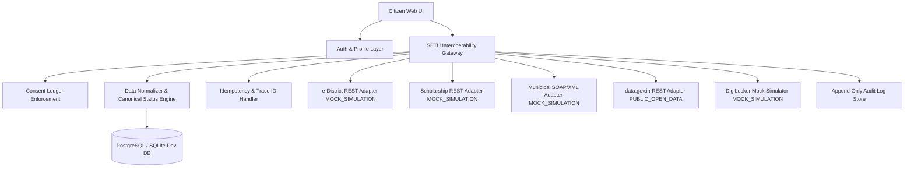

# SETU ("Bridge") - Unified Government Interoperability Gateway

> **ACADEMIC PROTOTYPE** — Not an official government platform. Do not enter real Aadhaar, OTPs, passwords, bank details, or real documents.

---

## 1. Problem & Architecture Overview

### Why Fragmentation Exists
India's federal structure splits government services across central ministries, state revenue departments, municipal local bodies, and third-party vendors. Each system uses separate databases, authentication flows, document requirements, and status formats. Citizens face:
1. **Duplicate Data Entry**: Re-entering basic demographic info on every portal.
2. **Repeated Document Uploads**: Uploading physical income & caste certificates repeatedly.
3. **Fragmented Service Discovery**: No single catalog for state and central schemes.
4. **Scattered Tracking**: No unified status visibility or canonical milestone tracking.

### The SETU Solution
SETU demonstrates a common interoperability layer:
- **API Gateway & Connector Adapters**: Standardized REST and SOAP/XML connectors with clear integration labels (`MOCK_SIMULATION`, `PUBLIC_OPEN_DATA`, `OFFICIAL_SANDBOX`, `PARTNER_ONLY`, `REDIRECT_ONLY`).
- **Canonical Status Engine**: Normalizes provider-specific statuses (`RECEIVED`, `PENDING_TAHSILDAR`) into 9 canonical statuses (`SUBMITTED`, `UNDER_REVIEW`, `APPROVED`, `FAILED_SYNC`, etc.).
- **Explicit Consent Ledger**: Purpose-bound, field-level citizen consent required before routing requests through the gateway.
- **Resilience & Idempotency**: Idempotency key deduplication and automatic retry (`FAILED_SYNC`) when endpoints simulate failures.
- **Append-Only Audit Trail**: Trace ID-indexed immutable security logs.



---

## 2. Fictional Demo Credentials

| Role | Email | Password | Prototype Citizen ID | Notes |
| :--- | :--- | :--- | :--- | :--- |
| **Citizen 1** | `citizen@setu.gov.in` | `Password123!` | `SETU-CIT-000123` | Pre-filled profile, verified documents, active consents |
| **Citizen 2** | `sunita@setu.gov.in` | `Password123!` | `SETU-CIT-000456` | Second demo citizen account |
| **Admin** | `admin@setu.gov.in` | `AdminPass123!` | N/A | Full access to Connector Health Monitor & Audit Logs |

---

## 3. Quickstart Local Setup

### Prerequisites
- Node.js v18+ and npm
- (Optional) Docker & Docker Compose

### Step 1: Run Backend Server
```bash
cd backend
npm install
npx prisma db push
npm run db:seed
npm run dev
```
*Backend API running on `http://localhost:5000`*  
*OpenAPI / Swagger UI docs available at `http://localhost:5000/api/docs`*

### Step 2: Run Frontend Web App
```bash
cd frontend
npm install
npm run dev
```
*Frontend running on `http://localhost:3000`*

### Step 3: Run with Docker Compose (Optional)
```bash
docker-compose up --build
```

---

## 4. Evaluator Walkthrough Demo Script

1. **Service Discovery**:
   - Open `http://localhost:3000`. Observe the Prajaseva navy visual language, emblem, and academic disclaimer banner.
   - Click **Services Directory** to inspect 12+ government services across 8 categories with visible **CONNECTOR LABELS** (`MOCK_SIMULATION`, `PUBLIC_OPEN_DATA`).

2. **Check Scheme Eligibility**:
   - Click **Check Eligibility Calculator** in the side drawer or hero section.
   - Enter Category `BC`, Income `180000`, Attendance `85%`. Click **Verify Eligibility**. See green pass box with eligible fee reimbursement schemes.

3. **Citizen Login & Single Profile Autofill**:
   - Click **Citizen Login** and use quick pill `Demo Citizen` (`citizen@setu.gov.in` / `Password123!`).
   - Navigate to **Services -> Post-Matric Tuition Fee Reimbursement -> Apply**.
   - Observe Step 1 Personal Details automatically pre-filled from your consented profile (Prototype ID `SETU-CIT-000123`, no Aadhaar required).

4. **Explicit Consent Authorization**:
   - Proceed through Stepper: Step 1 -> Step 2 -> Step 3 (Vault Doc) -> Step 4 (Preview & Submit).
   - Click **Review Consent & Submit**. Observe the **Explicit Data Consent Modal** displaying exact fields (`full_name`, `annual_income`, `category`), purpose, and 180-day expiry.
   - Click **Grant Consent & Submit**. Receive reference number `SETU-SCH-2026-XXXXX`.

5. **Consent Revocation & Gateway Block**:
   - Navigate to **Consent Dashboard** (`/consents`). Click **Revoke Consent** for a service.
   - Attempt to apply for that service again. Observe the gateway block with error code `GATEWAY_CONSENT_REQUIRED`.

6. **Track Application Status & XML Adapter**:
   - Navigate to **Track Application** (`/track`).
   - Enter reference `SETU-ED-2026-00045`. Observe canonical status `UNDER_REVIEW` and raw provider status `PENDING_TAHSILDAR`.
   - Track `SETU-MNC-2026-XXXXX` to view SOAP/XML legacy response normalization.

7. **Admin Interoperability Monitor & Failure Resilience**:
   - Login as Admin (`admin@setu.gov.in` / `AdminPass123!`).
   - Navigate to **Interoperability Health Monitor** (`/admin/health`).
   - Toggle **Simulate Timeout** to ON for e-District Gateway.
   - Submit a new application. Observe canonical status automatically maps to `FAILED_SYNC` ("Pending synchronization") without crashing.
   - Check **Audit Logs** (`/admin/audit`) to view trace ID-indexed immutable security logs.

---

## 5. Automated Tests

```bash
# Run backend Jest unit & gateway tests
cd backend
npm test
```
